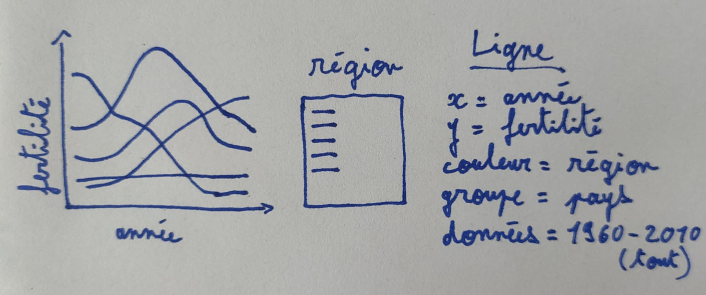

Traduction de [English](https://github.com/tdhock/animint-book/)
[Ch02-ggplot2](https://raw.githubusercontent.com/tdhock/animint-book/refs/heads/master/Ch02-ggplot2.Rmd)


# Chapitre 2, visualisation de données à l'aide de la grammaire graphique {#chapter-2}

```{r setup, echo=FALSE}
knitr::opts_chunk$set(fig.path="Ch02-figures/")
```

Ce chapitre explique la grammaire des graphiques, qui est un modèle puissant pour décrire une grande classe de visualisations de données. Après avoir lu ce chapitre, vous serez en mesure de

- citer les avantages de la grammaire graphique par rapport aux systèmes de tracé précédents
- Installer le package R animint2
- Traduire les dessins de graphe en code ggplot dans R
- Afficher des ggplots sur des pages web en utilisant animint2
- Créer des ggplots multicouches
- Créer des ggplots multi-panneaux

## Historique des commandes et objectif de la grammaire graphique {#history}

La plupart des systèmes informatiques d'analyse de données proposent des fonctions permettant de créer des graphes afin de visualiser les motifs des données. Les systèmes les plus anciens proposent des fonctions très générales permettant de dessiner les éléments de base d'un graphe, tels que des lignes et des points (par exemple, la fonction `graphics`  et `grid`  dans R). Si vous utilisez l'un de ces systèmes généraux, c'est à vous qu'il incombe d'assembler les composants pour former un graphe significatif et interprétable. L'avantage des systèmes généraux est qu'ils imposent peu de limites aux types de tracés qui peuvent être créés. L'inconvénient est que les systèmes généraux ne fournissent généralement pas de fonctions permettant d'automatiser les tâches courantes de tracé (axes, panneaux, légendes).

Pour pallier les inconvénients de ces systèmes de tracé généraux, des packages de tracé tels que `lattice`  ont été développés ( [Sarkar, 2008](http://lmdvr.r-forge.r-project.org/figures/figures.html) ). Ces packages disposent de plusieurs types de graphiques prédéfinis et fournissent une fonction dédiée à la création de chaque type de graphique. Par exemple, `lattice`  fournit la fonction `bwplot`  pour créer des graphes en boîte et des graphes avec des lignes de démarcation. L'avantage de ces systèmes est qu'ils facilitent grandement la création de tracés entiers, y compris une légende et des panneaux. L'inconvénient est l'ensemble des types de graphiques prédéfinis, ce qui signifie qu'il n'est pas facile de créer des graphiques plus complexes.

Les nouveaux systèmes de tracé basés sur la grammaire graphique se situent entre ces deux extrêmes. Wilkinson a proposé la grammaire des graphiques afin de décrire et de créer une grande classe de graphes ( [Wilkinson, 2005](http://www.springer.com/us/book/9780387245447?wt_mc=GoogleBooks.GoogleBooks.3.EN&token=gbgen#otherversion=9780387286952) ). Wickham a implémenté plus tard plusieurs idées de la grammaire graphique dans le projet `ggplot2`  package R ( [Wickham, 2009](https://www.amazon.com/dp/0387981403/ref=cm_sw_su_dp?tag=ggplot2-20) ). Les `ggplot2`  présentent plusieurs avantages par rapport aux systèmes de tracé précédents.

- Comme les systèmes de tracé généraux, et à la différence de `lattice` , `ggplot2`  impose peu de limites aux types de tracés qui peuvent être créés (il n'y a pas de types de graphiques prédéfinis).
- Contrairement aux systèmes de tracé généraux, et à l'instar de `lattice` , `ggplot2`  permet d'inclure facilement des éléments de graphe courants tels que des axes, des panneaux et des légendes.
- Depuis que `ggplot2`  est basé sur la grammaire des graphiques, il est nécessaire de mapper explicitement les variables de données aux propriétés visuelles. Plus loin dans ce chapitre, nous expliquerons comment ce mappage permet de dessiner des idées de graphe qui peuvent être directement traduites en code R.

Enfin, tous les systèmes de tracé évoqués précédemment sont destinés à la création de graphiques statiques, qui peuvent être visualisés aussi bien sur un écran d'ordinateur que sur du papier. Cependant, le sujet principal de ce manuel est `animint2` un package R pour les graphiques interactifs. Contrairement aux graphiques statiques, les graphiques interactifs sont mieux visualisés sur un ordinateur équipé d'une souris et d'un clavier permettant d'interagir avec le graphe.

Étant donné que de nombreux concepts des graphiques statiques sont également utiles dans les graphiques interactifs, le programme `animint2`  est implémenté en tant qu'extension/fork du package `ggplot2` . Dans ce chapitre, nous présenterons les principales caractéristiques de `ggplot2`  qui seront également utiles pour la conception de graphes interactifs dans les chapitres suivants.

En 2013, nous avons créé le package animint, qui dépend du package ggplot2. Cependant, au cours de la période 2014-2017, le package ggplot2 a introduit de nombreux changements qui étaient incompatibles avec la grammaire interactive de animint. Par conséquent, en 2018, nous avons créé le package animint2 qui copie/fourche les parties pertinentes du package ggplot2. Maintenant, animint2 peut être utilisé sans que ggplot2 soit installé. En fait, il est recommandé d'utiliser animint2 sans attacher (via la bibliothèque) ggplot2. Cependant, il est possible d'utiliser animint2 avec des packages qui importent/chargent ggplot2. Pour un exemple, voir [Chapitre 16](Ch16-change-point.html) qui utilise le package penaltyLearning (qui importe ggplot2).

## Installer et attacher animint2 {#installing}

Pour installer la version la plus récente de `animint2`  à partir du CRAN,

```{r installCRAN}
if(!requireNamespace("animint2"))install.packages("animint2")
```

Pour installer une version de développement encore plus récente de `animint2`  depuis GitHub,

```{r installGitHub}
if(!requireNamespace("animint2")){
  if(!requireNamespace("remotes"))install.packages("remotes")
  remotes::install_github("tdhock/animint2")
}
```

Une fois que vous avez installé animint2, vous pouvez charger et attacher toutes ses fonctions exportées via :

```{r attach}
library(animint2)
```

## Traduire des dessins de tracés en ggplots {#sketching}

Cette section explique comment traduire un dessin de graphe en code R. Nous utilisons un ensemble de données de la Banque mondiale comme exemple, et nous commençons par charger et examiner un sous-ensemble de ces données.

```{r data}
data(WorldBank, package="animint2")
WorldBank$Region <- sub(" (all income levels)", "", WorldBank$region, fixed=TRUE)
head(WorldBank)
tail(WorldBank)
dim(WorldBank)
```

Les `WorldBank`  consiste en des mesures telles que le taux de fécondité et l'espérance de vie pour chaque pays sur la période 1960-2010. Le code ci-dessus imprime les premières et dernières lignes, ainsi que la dimension du tableau de données ( `r nrow(WorldBank)`  lignes et `r ncol(WorldBank)`  colonnes).

Supposons que nous voulions voir s'il existe une relation entre l'espérance de vie et le taux de fécondité. Nous pourrions fixer une année, puis utiliser ces deux variables de données dans un nuage de points. La figure ci-dessous dessine les principaux éléments de cette visualisation de données.


Le dessin ci-dessus montre l'espérance de vie sur l'axe horizontal (x), le taux de fécondité sur l'axe vertical (y) et une légende pour la région. Ces éléments du dessin peuvent être directement traduits en code R à l'aide de la méthode suivante. Tout d'abord, nous devons construire un tableau de données comportant une ligne pour chaque pays en 1975, et des colonnes nommées `life.expectancy` , `fertility.rate` , et `region` . Les `WorldBank`  possèdent déjà ces colonnes, il suffit donc de considérer le sous-ensemble pour l'année 1975 :

```{r head}
WorldBank1975 <- subset(WorldBank, year==1975)
head(WorldBank1975)
```

Le code ci-dessus imprime les données pour 1975, qui ont clairement les colonnes appropriées, et une ligne pour chaque pays. L'étape suivante consiste à utiliser les notes du dessin pour coder un ggplot avec une fonction correspondante de `aes`  ou un mappage esthétique des variables de données aux propriétés visuelles :

```{r scatter}
scatter <- ggplot()+
  geom_point(
    mapping=aes(x=life.expectancy, y=fertility.rate, color=Region),
    data=WorldBank1975)
scatter
```

Le `aes`  est appelée avec les noms des propriétés visuelles ( `x` , `y` , `color` ) et les valeurs des variables de données correspondantes ( `life.expectancy` , `fertility.rate` , `region` ). Ce mappage est appliqué aux variables de la `WorldBank1975`  tableau de données, afin de créer les propriétés de visualisation de la `geom\_point` . Le ggplot a été sauvegardé en tant que fichier `scatter`  qui, lorsqu'il est imprimé sur la ligne de commande R, affiche le graphe sur un périphérique graphique. Notez que nous avons automatiquement un objet `region`  légende en couleur.

## Afficher des ggplots sur des pages web à l'aide d'animint {#rendering-with-animint}

Cette section explique comment l'outil `animint2`  peut être utilisé pour afficher des ggplots sur des pages web. Le ggplot de la section précédente peut être affiché avec animint2, en utilisant l'option `animint`  en utilisant la fonction

```{r Ch02-scatter}
animint(scatter)
```

Si, lorsque vous exécutez le code ci-dessus, l'animint ne s'affiche pas dans votre explorateur web pour une raison quelconque (par exemple si vous voyez une page web vierge), veuillez consulter notre section [FAQ wiki](https://github.com/tdhock/animint2/wiki/FAQ#web-browser-on-local-indexhtml-file-is-blank)  qui vous aidera à trouver une solution.  En interne, l'animint `animint`  crée une liste de classes animint, puis R exécute la fonction `print.animint`  via la fonction [système d'objets S3](http://adv-r.had.co.nz/OO-essentials.html#s3) . Le système `animint2`  implémente un compilateur qui prend la liste en entrée et produit une page web avec une visualisation de données.  Le compilateur est le paquet `animint2dir`  qui compile l'animint `scatter.viz`  en un répertoire de fichiers de données et de code qui peuvent être affichés dans un explorateur web.  Elle est activée automatiquement par la fonction `print.animint`  fonction.

Lorsqu'il est visualisé dans un explorateur web, le graphe animint devrait être pratiquement identique aux versions statiques produites par les périphériques graphiques R standard. Une différence est que la légende de la région est interactive : en cliquant sur une entrée de la légende, les points de cette couleur sont cachés ou affichés.

Exercice : essayez de modifier la valeur de `aes`  de la cartographie du ggplot, puis de créer une nouvelle animint. Les variables quantitatives comme `population`  sont mieux représentées à l'aide de la fonction `x` / `y`  ou le point `size` . Les variables qualitatives comme `lending`  sont mieux représentées en utilisant le point `color`  ou `fill` .

## Visualisation de données multicouches (plusieurs geoms) {#multi-layer}

La visualisation de données multicouches est utile lorsque vous souhaitez afficher plusieurs geoms ou ensembles de données différents dans le même graphe. Par exemple, considérons le dessin suivant qui ajoute une couche de `geom\_path`  à la visualisation de données précédente.


Notez que le dessin ci-dessus comprend deux geoms différents (point et chemin). Les deux geoms partagent une définition commune de l'élément `x` , `y` , et `color`  esthétique, mais avec des ensembles de données différents. Nous traduisons ci-dessous ce dessin en code R.

```{r Ch02-two-layer-viz}
WorldBankBefore1975 <- subset(WorldBank, 1970 <= year & year <= 1975)
two.layers <- scatter+
  geom_path(aes(
    x=life.expectancy, 
    y=fertility.rate, 
    color=Region,
    group=country),
    data=WorldBankBefore1975)
(viz.two.layers <- animint(two.layers))
```

Notez que nous sauvegardons la valeur de retour (abcd -> dcba) (d'une fonction). `animint`  dans le fichier `viz.two.layers`  (qui est également imprimée en raison des parenthèses). Dans ce manuel, nous utiliserons souvent des noms de variables commençant par `viz`  pour désigner les objets de visualisation de données animint, qui sont en fait des listes de ggplots et d'options.

Le graphe ci-dessus montre une visualisation de données avec 2 geoms/couches :

- le `geom\_point`  montre l'espérance de vie, le taux de fécondité et la région de tous les pays en 1975.
- L'espérance de vie, le taux de fécondité et la région de tous les pays en 1975. `geom\_path`  montre les mêmes variables pour les 5 années précédentes.

L'ajout de la `geom\_path`  montre comment les pays ont changé au fil du temps. En particulier, il montre que la plupart des pays se sont déplacés vers la droite et vers le bas, ce qui signifie une espérance de vie plus élevée et un taux de fécondité plus faible. Il y a cependant quelques exceptions. Par exemple, les deux pays d'Asie de l'Est situés en bas à gauche ont vu leur espérance de vie diminuer au cours de cette période. Par ailleurs, certains pays ont vu leur taux de fécondité augmenter.

Exercice : essayez de changer le `region`  par une `income`  légende. Conseil : vous devez utiliser le même `aes(color=income)`  pour tous les geoms. Vous pouvez utiliser `scale\_color\_manual`  avec une palette de couleurs séquentielle, voir `RColorBrewer::display.brewer.all(type="seq")`  et [lire l'annexe pour plus de détails](Ch99-appendix.html#manual-color-legends) .

Pouvons-nous ajouter les noms des pays à l'image de données ? Ci-dessous, nous ajoutons une autre couche avec une étiquette de texte pour le nom de chaque pays.

```{r Ch02-three-layer-viz}
three.layers <- two.layers+
  geom_text(aes(
    x=life.expectancy, 
    y=fertility.rate, 
    color=Region,
    label=country),
    data=WorldBank1975)
animint(three.layers)
```

Cette image de données n'est pas très facile à lire, car il y a beaucoup d'étiquettes de texte qui se chevauchent. La légende interactive des régions aide un peu, en permettant à l'utilisateur de masquer les données des régions sélectionnées. Cependant, ce serait encore mieux si l'utilisateur pouvait afficher et masquer le texte pour les pays individuels. Ce type d'interaction peut être réalisé en utilisant l'esthétique showSelected et clickSelects que nous expliquons dans les chapitres 3-4.

Pour l'instant, nous passons à l'examen d'un atout majeur d'animint : la visualisation de données à l'aide de plusieurs graphes liés.

## Visualisation de données en plusieurs graphes {#multi-plot}

La visualisation de données à plusieurs graphes est utile lorsque vous souhaitez présenter des ensembles de données liés en utilisant plus d'un mappage esthétique. Dans la visualisation de données interactive, un graphe est souvent utilisé pour afficher un résumé et un autre pour afficher les détails. Prenons l'exemple d'une visualisation de données comportant deux graphes : une série chronologique avec les données de la Banque mondiale de 1960 à 2010 (résumé) et un nuage de points avec les données de 1975 (détails). Nous dessinons ci-dessous le graphe de la série chronologique.



Notez que le dessin ci-dessus peut être directement traduit dans le code R ci-dessous.  Pour plus de simplicité, nous commençons par réduire l'échantillonnage des données à tous les cinq ans (certains explorateurs web comme Chrome ne sont pas en mesure d'afficher plus de 10 000 points de données en une seule fois),

```{r}
WorldBankSome <- subset(WorldBank, year %% 5 == 0)
dim(WorldBankSome)
table(WorldBankSome$year)
```

Le tableau de contingence ci-dessus montre qu'il y a 214 lignes pour chacune des années de l'ensemble de données.  Ensuite, nous copions la liste de viz existante ( `viz.two.layers` ), puis nous assignons un ggplot à un nouvel élément nommé `timeSeries` .

```{r vizTwoPlots}
viz.two.plots <- viz.two.layers
viz.two.plots$timeSeries <- ggplot()+
  geom_line(aes(
    x=year, 
    y=fertility.rate, 
    color=Region, 
    group=country),
    data=WorldBankSome)
```

Il en résulte une liste nommée de deux éléments (les deux éléments sont des ggplots avec la classe `gganimint` ).

```{r summaryTwo}
summary(viz.two.plots)
```

Cette liste de visualisation de données peut être imprimée ou affichée en tapant son nom. Puisque la liste contient deux ggplots, `animint2`  affiche la visualisation de données sous la forme de deux graphes liés.

```{r Ch02-viz-two-plots}
viz.two.plots
```

La visualisation de données ci-dessus contient deux ggplots, qui mappent chacun des variables de données différentes sur le plan horizontal. `x`  l'axe horizontal. La série temporelle utilise `aes(x=year)` et montre un résumé des valeurs du taux de fécondité pour toutes les années. Le nuage de points utilise `aes(x=life.expectancy)` et montre les détails de la relation entre le taux de fécondité et l'espérance de vie en 1975.

Essayez de cliquer sur une entrée de légende dans le nuage de points ou dans la série chronologique ci-dessus. Vous devriez voir les données et les légendes des deux graphes se mettre à jour simultanément. Depuis `aes(color=Region)`  a été spécifié dans les deux graphes, animint crée une seule variable de sélection partagée appelée `Region` . Cliquer sur l'une ou l'autre légende a pour effet de mettre à jour l'ensemble des régions sélectionnées, et animint met donc à jour les légendes et les données dans les deux graphes en conséquence. Il s'agit du principal mécanisme utilisé par animint pour créer des visualisations de données interactives avec des graphes liés, et il sera discuté plus en détail dans les deux prochains chapitres.

Exercice : utilisez animint pour créer une visualisation de données avec trois graphes, en créant une liste avec trois ggplots. Par exemple, vous pourriez ajouter une série temporelle d'une autre variable de données telle que `life.expectancy`  ou `population` .

Notez que les deux ggplots mappent la variable taux de fécondité sur l'axe des y. Cependant, comme il s'agit de deux graphes distincts, les plages (ou étendues ou intervalles) de leurs axes des ordonnées sont calculées séparément. Cela signifie que même lorsque les deux graphes sont affichés côte à côte, les deux axes des ordonnées ne sont pas exactement alignés. C'est un problème car il serait plus facile de décoder la visualisation des données si chaque unité d'espace vertical était utilisée pour montrer la même quantité de taux de fécondité. Pour obtenir cet effet, nous utilisons les facettes dans la section suivante.

## Visualisation de données multi-panneaux (facettes) {#multi-panel}

Les panneaux ou facettes sont des sous-tracés qui présentent des visualisations de données connexes. L'un des principaux atouts de ggplots est qu'il est relativement facile de créer différents types de graphes à panneaux multiples. La visualisation de données multi-panneaux est utile pour deux raisons différentes :

- Vous souhaitez aligner les axes de plusieurs tracés connexes contenant différents geoms. Cela facilite la comparaison entre plusieurs geoms différents et c'est une technique qui est également utile pour la visualisation interactive des données.
- Vous souhaitez diviser les données d'un geom en plusieurs panneaux. Cette technique facilite la comparaison entre des sous-ensembles de données et est moins utile pour la visualisation interactive de données (l'interactivité peut souvent être utilisée à la place, pour obtenir le même effet de comparaison de sous-ensembles de données).

### Différents geom dans chaque panneau (axes alignés) {#aligned-axes}

Nous commençons par expliquer comment les facettes sont utiles pour aligner les axes de graphiques apparentés. Considérons le dessin ci-dessous qui contient un graphe avec deux panneaux.


Notez que les deux panneaux tracent des geoms différents à l'aide d'une cartographie esthétique spécifique au panneau. Le point et le chemin d'accès dans le panneau de gauche ont `x=life.expectancy` et la ligne du panneau de droite a `x=year` . Notez également que nous avons spécifié `facet=x.var` nous devons donc ajouter une variable appelée `x.var`  à chacun des trois ensembles de données. Nous traduisons ce dessin en code R ci-dessous.

```{r Ch02-viz-aligned}
add.x.var <- function(df, x.var){
  data.frame(df, x.var=factor(x.var, c("life expectancy", "year")))
}
(viz.aligned <- animint(
  scatter=ggplot()+
    theme_bw()+
    theme_animint(width=600)+
    geom_point(aes(
      x=life.expectancy, y=fertility.rate, color=Region),
      data=add.x.var(WorldBank1975, "life expectancy"))+
    geom_path(aes(
      x=life.expectancy, y=fertility.rate, color=Region,
      group=country),
      data=add.x.var(WorldBankBefore1975, "life expectancy"))+
    geom_line(aes(
      x=year, y=fertility.rate, color=Region, group=country),
      data=add.x.var(WorldBankSome, "year"))+
    xlab("")+
    facet_grid(. ~ x.var, scales="free")))
```

La visualisation de données ci-dessus contient un seul ggplot avec deux panneaux et trois couches. Le panneau de gauche montre les `geom\_point`  et `geom\_path` et le panneau de droite montre les `geom\_line` . Les panneaux ont un axe commun pour le taux de fécondité, ce qui permet de comparer directement les lignes du panneau des séries chronologiques avec les points et les chemins du panneau du nuage de points.

Il est à noter que nous avons utilisé le `add.x.var`  pour ajouter un `x.var`  à chaque ensemble de données, puis nous avons utilisé cette variable dans la fonction `facet\_grid(scales="free")` . Nous appelons cela la fonction [addColumn then facet idiom](Ch99-appendix.html#addColumn-then-facet) qui est généralement utile pour créer une visualisation de données à plusieurs panneaux avec des axes alignés. En particulier, si nous voulions changer l'ordre des panneaux dans la visualisation de données, il nous suffirait de modifier l'ordre des niveaux de facteurs dans la définition de la facette `add.x.var` .

Notez également que `theme\_bw`  signifie qu'il faut utiliser des bordures de panneaux noires et des fonds de panneaux blancs, et que `panel.margin=0`  signifie qu'il n'y a pas d'espace entre les panneaux. En éliminant l'espace entre les panneaux, on utilise plus d'espace pour les panneaux, ce qui permet d'accentuer les données. C'est ce que nous appelons le [idiome des facettes économes en espace](Ch99-appendix.html#space-saving-facets) qui est généralement utile dans tout ggplot avec des facettes.

Dans l'image de données ci-dessus, les étiquettes de texte se chevauchent un peu, ce qui peut être corrigé par l'une ou l'autre des méthodes suivantes (exercice pour le lecteur)

- en utilisant `breaks`  l'argument de `scale\_x\_continuous()`
- la réduction de la taille du texte avec `theme()`  et `element\_text()`
- l'augmentation de la largeur du gracé à l'aide de `theme\_animint()` voir [Chapitre 6](Ch06-other.html#plot-height-width)  pour plus d'informations.

### Mêmes geoms dans chaque panneau (réalisation de sous-ensembles de données) {#compare-data-subsets}

La deuxième raison d'utiliser des graphes avec plusieurs panneaux dans une visualisation de données est de comparer des sous-ensembles d'observations. Cela facilite la comparaison entre les sous-ensembles de données et peut être utilisé dans au moins deux situations différentes :

- L'ensemble de données d'un geom comporte trop d'observations pour être affiché de manière informative dans un seul panneau.
- Vous souhaitez comparer différents sous-ensembles de données tracées pour un geom.

Prenons l'exemple du dessin ci-dessous.


Notez que les trois panneaux tracent les deux mêmes geoms (point et chemin). Puisque les `facet=show.year` et qu'il y a trois panneaux, nous devrons créer des tableaux de données qui auront trois valeurs pour la variable `show.year`  pour trois valeurs. Les `geom\_point`  ne contient des données que pour 3 ans, et le tableau `geom\_path`  a des données pour 15 ans (mais 3 valeurs de `show.year` ). Le code ci-dessous crée ces deux ensembles de données pour trois années de l'ensemble de données de la Banque mondiale.

```{r}
show.point.list <- list()
show.path.list <- list()
for(show.year in c(1975, 1985, 1995)){
  show.point.list[[paste(show.year)]] <- data.frame(
    show.year, subset(WorldBank, year==show.year))
  show.path.list[[paste(show.year)]] <- data.frame(
    show.year, subset(WorldBank, show.year - 5 <= year & year <= show.year))
}
show.point <- do.call(rbind, show.point.list)
show.path <- do.call(rbind, show.path.list)
```

Nous avons utilisé une boucle for sur trois valeurs de `show.year` la variable que nous utiliserons plus tard dans `facet\_grid` . Pour chaque valeur de `show.year` nous stockons un sous-ensemble de données sous la forme d'un élément nommé d'une liste. Après la boucle for, nous utilisons `do.call`  avec `rbind`  pour combiner les sous-ensembles de données. Il s'agit d'un exemple de la méthode [tableau de données idiome](Ch99-appendix.html#list-of-data-tables) qui est généralement utile pour la visualisation de données interactive.

Ci-dessous, nous nous penchons sur l'idiome `show.year`  pour créer une visualisation de données avec trois panneaux.

```{r Ch02-viz-panels}
animint(
  scatter=ggplot()+
    geom_point(aes(
      x=life.expectancy, y=fertility.rate, color=Region),
      data=show.point)+
    geom_path(aes(
      x=life.expectancy, y=fertility.rate, color=Region,
      group=country),
      data=show.path)+
    facet_grid(. ~ show.year)+
    theme_bw())
```

La visualisation de données ci-dessus contient un seul ggplot avec trois panneaux. Elle montre une plus grande partie de l'ensemble des données de la Banque mondiale que les visualisations précédentes qui ne montraient que les données de 1975. Cependant, elle ne montre qu'un sous-ensemble de données relativement restreint. Vous pourriez être tenté d'utiliser un panneau pour afficher chaque année (pas seulement 1975, 1985 et 1995). Sachez toutefois que ce type de visualisation de données à plusieurs panneaux n'est utile que s'il n'y a que quelques sous-ensembles de données. Au-delà d'une dizaine de panneaux, il devient difficile de voir toutes les données en même temps, et donc de faire des comparaisons significatives.

Au lieu de montrer toutes les données en même temps, nous pouvons créer une visualisation de données animée qui montre à l'observateur différents sous-ensembles de données au fil du temps. Dans l'outil de visualisation [chapitre suivant](Ch03-showSelected.html) nous montrerons comment la nouvelle `showSelected`  peut être utilisé pour réaliser une animation, et nous révélerons plus de détails sur cet ensemble de données.

## Résumé du chapitre et exercices {#exercises}

Ce chapitre a présenté les bases de la visualisation de données statiques à l'aide de ggplot2. Nous avons montré comment animint peut être utilisé pour afficher une liste de ggplots dans un explorateur web. Nous avons expliqué deux caractéristiques de ggplot2 qui le rendent idéal pour la visualisation de données : les graphiques multicouches et multi-panneaux.

Exercices :

- Quels sont les trois principaux avantages de la `ggplot2`  par rapport aux systèmes de tracé antérieurs tels que `grid`  et `lattice` ?

- Quel est l'objectif des graphiques multicouches ?

- Quelles sont les deux raisons différentes de créer des graphiques à panneaux multiples ? Lequel de ces deux types est utile pour l'interactivité ?

- Définissons "A \< B" comme signifiant qu'"un B peut contenir plusieurs A".  Laquelle des affirmations suivantes est vraie ?
  
  - ggplot \< panel
  - panel \< ggplot
  - ggplot \< animint
  - animint \< ggplot
  - layer \< panel
  - panneau \< couche
  - couche \< ggplot
  - ggplot \< couche

- Dans la couche `viz.aligned`  pourquoi est-il important d'utiliser l'option `scales="free"`  argument ?

- En ce qui concerne les facettes, pourquoi est-il important d'utiliser l'argument ? `viz.aligned`  nous avons montré un ggplot avec un panneau de nuage de points à gauche et un panneau de séries temporelles à droite. Réalisez une autre version de la visualisation de données avec le panneau des séries temporelles à gauche et le panneau du nuage de points à droite.

- En `viz.aligned`  le nuage de points affiche le taux de fécondité et l'espérance de vie, mais la série chronologique n'affiche que le taux de fécondité. Réalisez une autre version de la visualisation de données qui montre les deux séries temporelles. Conseil : utilisez les panneaux horizontaux et verticaux dans la visualisation de données. `facet\_grid` .

- Utiliser `aes(size=population)`  dans le nuage de points pour indiquer la population de chaque pays. Indice : `scale\_size\_animint(pixel.range=c(5, 10)`  signifie que des cercles d'un rayon de 5/10 pixels doivent être utilisés pour représenter la population minimale/maximale.

- Créez une visualisation de données à plusieurs panneaux qui montre chaque année de la `WorldBank`  dans un panneau séparé. Quelles sont les limites de l'utilisation de graphiques statiques pour visualiser ces données ?

- Créer `viz.aligned`  en utilisant un système de tracé qui n'est pas basé sur la grammaire des graphiques. Par exemple, vous pouvez utiliser les fonctions du `graphics`  du package R ( `plot` , `points` , `lines` etc.), ou matplotlib en Python. Quels sont les avantages de ggplot2 et animint ?

Suivant, [Chapitre 3](Ch03-showSelected.html)  explique les `showSelected`  qui indique une variable à utiliser pour le sous-ensemble des données avant le tracé.


