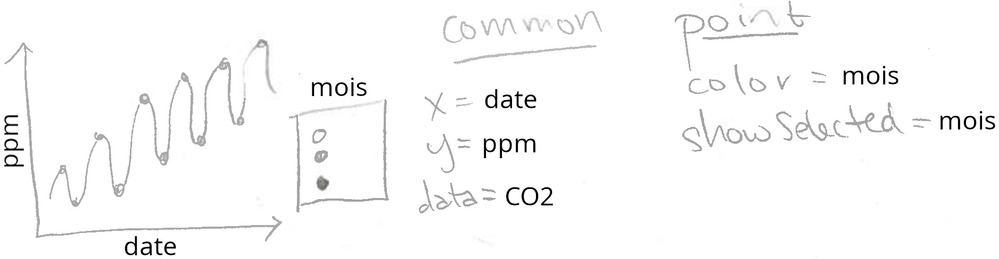
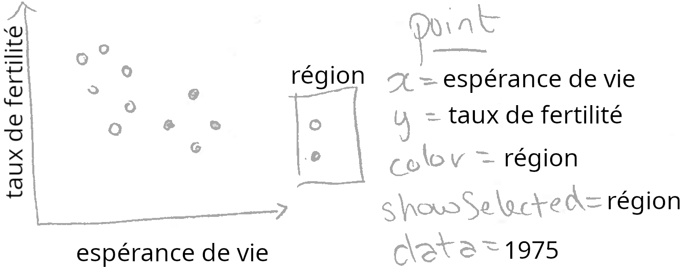
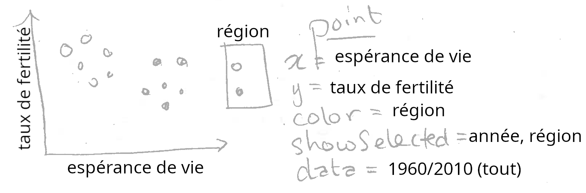

# Chapter 3, the showSelected keyword

<!-- comment -->

```{r setup, echo=FALSE}
knitr::opts_chunk$set(fig.path="Ch03-figures/")
```

<!-- comment -->

Ce chapitre explique `showSelected`, l'un des deux principaux mots-clés introduits par `animint2` pour la visualisation interactive de données.
<!-- comment -->
Après avoir lu ce chapitre, vous serez en mesure de

<!-- comment -->

- Utiliser le mot-clé `showSelected` dans vos esquisses pour spécifier des geoms pour lesquels seul un sous-ensemble de données doit être tracé à la fois.
<!-- comment -->
- Utiliser les menus de sélection pour modifier le sous-ensemble de données tracées.
<!-- comment -->
- Spécifier des transitions fluides entre les sous-ensembles de données à l'aide de l'option `duration` et `aes(key)`.
<!-- comment -->
- Créer des visualisations de données animées à l'aide de l'option `time`.

<!-- comment -->

## Esquisses avec `showSelected` {#esquisses}

<!-- comment -->

Dans cette section, nous allons expliquer comment le mot-clé `showSelected` peut être utilisé dans les esquisses.
<!-- comment -->
Le mot-clé `showSelected` spécifie une variable à utiliser pour sélectionner un sous-ensemble de données.
<!-- comment -->
Chaque geom d'une visualisation de données possède son propre ensemble de données, et sa propre définition des variables `showSelected`.
<!-- comment -->
Cela signifie que des geoms différents peuvent spécifier des ensembles de données et des mots-clés `showSelected` différents pour afficher des sous-ensembles de données différents.

<!-- comment -->

En fait, nous avons déjà utilisé le mot-clé `showSelected`, qui a été automatiquement créé par les légendes interactives que nous avons créées dans les deux chapitres précédents.
<!-- comment -->
Par exemple, considérons l'esquisse ci-dessous, de [la courbe de Keeling du chapitre 1](Ch01-motivation.html#large-data).

<!-- comment -->



<!-- comment -->
L'esquisse ci-dessus comprend `showSelected=mois` pour le `geom_point` ce qui signifie qu'il doit afficher le sous-ensemble de données pour les mois sélectionnés.
<!-- comment -->
En revanche, étant donné que `geom_line` n'inclut pas `showSelected`, il affiche toujours l'ensemble complet des données (quels que soient les mois sélectionnés).

<!-- comment -->

Prenons un autre exemple : le dessin ci-dessous de la première visualisation de données de la banque mondiale, du chapitre 2.

<!-- comment -->



<!-- comment -->

L'esquisse ci-dessus spécifie `showSelected=région` pour le `geom_point`, ce qui signifie qu'il doit afficher le sous-ensemble de données pour les régions sélectionnées.

<!-- comment -->

Notez que le code que nous avons utilisé dans chapitre 2 ne spécifiait pas explicitement `showSelected=région`.
<!-- comment -->
Au lieu de cela, nous avons spécifié `aes(color=région)` et `animint2` a automatiquement rajouté un mot-clé `showSelected`.
<!-- comment -->
En général, `animint2` rajoute un mot-clé `showSelected` pour chaque variable utilisée dans une légende qualitative.

<!-- comment -->

Cependant, le mot-clé `showSelected` n'est pas limité aux légendes qualitatives.
<!-- comment -->
Vous pouvez utiliser les mots-clés `showSelected` pour toutes les variables que vous souhaitez, en spécifiant explicitement les noms des variables dans l'argument `showSelected` du geom.

<!-- comment -->

Chaque variable utilisée avec `showSelected` est traitée par `animint2` comme une variable de sélection.
<!-- comment -->
Par exemple, la visualisation de la courbe de Keeling a une variable de sélection (`mois`), tout comme la visualisation de la Banque Mondiale (`région`).
<!-- comment -->
Pour chaque variable de sélection, `animint2` stocke les valeurs actuellement sélectionnées.
<!-- comment -->
Lorsque la sélection change, `animint2` met à jour le sous-ensemble de données affiché.

<!-- comment -->

Chacune des visualisations esquissées ci-dessus ne comporte qu'une seule variable de sélection.
<!-- comment -->
Cependant, une visualisation de données peut comporter un nombre quelconque de variables de sélection.
<!-- comment -->
Dans la section suivante, nous allons étudier une visualisation des données de la Banque Mondiale, qui comporte des variables de sélection pour `région`  et `année`.

<!-- comment -->

## Sélection de sous-ensembles avec menus {#selection-avec-menus}

<!-- comment -->

Considérons l'esquisse suivant, avec une variable `showSelected` de plus, et avec un différent ensemble de données.

<!-- comment -->



<!-- comment -->

Notez qu'il y a deux variables `showSelected` : `région` et `année`.
<!-- comment -->
Notez également que les données sont spécifiées pour toutes les années (mais une seule année sera affichée à la fois, grâce au `showSelected=année`).
<!-- comment -->
Ci-dessous, nous traduisons l'esquisse en code R.

<!-- comment -->

```{r}
library(animint2)
data(BanqueMondiale, package="animint2fr")
nuage <- ggplot()+
  geom_point(aes(
    x=espérance.de.vie, y=taux.de.fertilité, color=région),
    showSelected="année",
    data=BanqueMondiale)
nuage
```

<!-- comment -->

Notez que le code ci-dessus contient le mot-clé `showSelected`, ce qui est nouveau dans `animint2`, par rapport à `ggplot2`.
<!-- comment -->
Le mot-clé `showSelected` est ignoré lorsque le graphe est affiché comme ci-dessus, avec les fonctions d'affichage habituelles dans R, qui dessinent un nuage de points qui comprend toutes les années.
<!-- comment -->

En revanche, donner le code ci-dessus comme argument pour `animint()` donne la visualisation interactive ci-dessous, qui dessine une année à la fois.

<!-- comment -->

```{r Ch03-viz-scatter}
animint(nuage)
```

<!-- comment -->

Notez que la visualisation ci-dessus comporte deux variables de sélection : `région` et `année` (`color=région` fait que `région` est automatiquement une variable `showSelected`).
<!-- comment -->
Chaque variable dispose d'un menu en bas qui peut être utilisé pour modifier la sélection en cours.
<!-- comment -->
Dans cette visualisation, ces menus sont affichés par défaut.
<!-- comment -->
Ils peuvent être masqués en cliquant sur le bouton "Hide selection menus", et réaffichés en cliquant sur le bouton "Show selection menus".

<!-- comment -->

Les variables discrètes, telles que `région`, ont la sélection multiple par défaut, de sorte que plusieurs valeurs sont sélectionnées et affichées à la fois.
<!-- comment -->
Essayez de modifier la région sélectionnée dans la légende interactive et dans le menu de sélection.
<!-- comment -->
Lorsque vous modifiez la sélection à l'aide d'une des méthodes, la légende interactive et le menu de sélection sont tous les deux mis à jour, pour refléter la sélection actuelle.

<!-- comment -->

Nous utilisons les termes "manipulation directe" et "manipulation indirecte" pour décrire ces différentes façons de modifier la sélection.
<!-- comment -->
La manipulation directe est généralement plus facile à comprendre, parce qu'il s'agit de cliquer sur les objets que l'on souhaite modifier dans le graphique.
<!-- comment -->
En revanche, les techniques de manipulation indirecte, telles que les menus, sont utiles dans d'autres cas (par exemple, sélection d'un pays par nom).
<!-- comment -->
Dans la visualisation ci-dessus, vous pouvez modifier la valeur de `région` en utilisant soit la légende, soit le menu.
<!-- comment -->
L'utilisation de la légende est une technique de manipulation plus directe, puisque la légende est dessinée plus près du nuage de points qui sera mis à jour.

<!-- comment -->

D'autres variables de sélection, comme `année`, ont la sélection simple par défaut, de sorte qu'une seule valeur est sélectionnée et affichée à la fois.
<!-- comment -->
Essayez de modifier la valeur sélectionnée de la variable `année`, à l'aide du menu de sélection.
<!-- comment -->
Vous devriez voir le nuage de points se mettre à jour immédiatement pour afficher le taux de fertilité et l'espérance de vie de tous les pays au cours de l'année que vous avez sélectionnée.

<!-- comment -->

Exercice multi-couche : ajoutez un autre geom à ce nuage de points interactif.
<!-- comment -->
Comme dans le [Chapitre 2](Ch02-ggplot2.html#multi-layer) vous pouvez utiliser un `geom_text` pour afficher le nom de chaque pays (facile), ou un `geom_text` pour afficher l'année sélectionnée (moyen), ou un `geom_path` pour afficher les données des 5 années précédentes (difficile).
<!-- comment -->
Astuce : utilisez `showSelected=année` dans tous les geoms.

<!-- comment -->

Exercice multi-geom : ajoutez une série temporelle à la visualisation de données ci-dessus.
<!-- comment -->
Comme dans le [Chapitre 2](Ch02-ggplot2.html#multi-plot) vous pouvez utiliser un `geom_line` pour afficher le taux de fertilité de chaque pays, pour toutes les années.
<!-- comment -->
Ajoutez un `geom_vline` avec `showSelected=année` pour mettre en évidence l'année sélectionnée.

<!-- comment -->

## Transitions : l'option `duration` et `aes(key)` {#duration-key}

<!-- comment -->

Vous avez peut-être remarqué qu'il y a des boutons en bas de chaque visualisation de données créée par animint2.
<!-- comment -->
Essayez de cliquer sur le bouton "Show animation controls" ci-dessus.
<!-- comment -->
Ce tableau contient une ligne pour chaque variable de sélection.
<!-- comment -->
Les zones de texte indiquent le nombre de millisecondes utilisées pour les durées de transition après la mise à jour de chaque variable de sélection.
<!-- comment -->
Pour chaque variable de sélection, la durée de transition par défaut est 0, ce qui signifie que les données seront immédiatement placées à leur nouvelle position après la mise à jour de chaque variable.

<!-- comment -->

Pour illustrer l'importance des durées de transition, essayez de changer la valeur de la durée de transition de la variable `année` à 2000.
<!-- comment -->
Ensuite, utilisez le menu pour modifier la valeur sélectionnée de la variable `année`.
<!-- comment -->
Vous devriez voir les points de données se déplacer lentement vers leurs nouvelles positions, sur une durée de 2 secondes.

<!-- comment -->

Certaines transitions n'entraînent qu'un léger déplacement des points vers des positions proches (par exemple, 1979-1980).
<!-- comment -->
D'autres transitions entraînent un déplacement beaucoup plus important des points, vers des localisations plus éloignées (par exemple 1980-1981).
<!-- comment -->
Comment cela se fait-il ?

<!-- comment -->

Les transitions fluides n'ont de sens que pour les points de données qui existent à la fois avant et après la modification de la sélection.
<!-- comment -->
Dans le code R ci-dessous, nous calculons un tableau de contingences des points de données qui peuvent être tracés dans chacune de ces trois années.

<!-- comment -->

```{r}
trois.ans <- subset(BanqueMondiale, 1979 <= année & année <= 1981)
can.plot <- with(trois.ans, {
  (!is.na(espérance.de.vie)) & (!is.na(taux.de.fertilité))
})
table(trois.ans$année, can.plot)
```

<!-- comment -->

Le tableau de contingence ci-dessus montre clairement que 187 points peuvent être tracés en 1979 et 1980. 
<!-- comment -->
Cependant, en 1981, il y a un point de données supplémentaire, correspondant à un pays pour lequel nous n'avions pas de données en 1980. 
<!-- comment -->
Nous présentons ci-dessous les données de ce pays, le Kosovo.

<!-- comment -->

```{r}
subset(trois.ans, pays=="Kosovo")
```

<!-- comment -->

En effet, le tableau de contingence ci-dessus montre que le taux de fertilité et l'espérance de vie sont manquants pour le Kosovo en 1979-1980. 
<!-- comment -->
Il n'est donc pas logique d'effectuer une transition en douceur pour des pays tels que le Kosovo, qui ne seraient pas tracés ni avant ni après la transition. 
<!-- comment -->
Comment spécifier cela dans la visualisation de données ? 
<!-- comment -->
Dans le code ci-dessous, nous utilisons `aes(key=pays)` pour spécifier que les `pays` doit être utilisée pour faire correspondre les points de données avant et après la modification de la sélection.

<!-- comment -->

```{r}
nuage.key <- ggplot()+
  geom_point(aes(
    x=espérance.de.vie, y=taux.de.fertilité, color=région,
    key=pays),
    showSelected="année",
    data=BanqueMondiale)
```

<!-- comment -->

Le `key` dans le ggplot ci-dessus n'a de sens que pour la visualisation interactive des données, il est donc ignoré lorsqu'il est affiché avec les périphériques graphiques R habituels.
<!-- comment --> 
Cependant, si nous affichons ce ggplot en utilisant animint2, la variable `pays` sera utilisée pour s'assurer que les durées de transition sont significatives.
<!-- comment -->
Pour spécifier une durée de transition par défaut pour la variable `année` nous utilisons l'option `duration` dans l'image de données ci-dessous.

<!-- comment -->

```{r Ch03-viz-duration}
(viz.duration <- animint(nuage.key, duration=list(année=2000)))
```

<!-- comment -->

L'option `duration` doit être une liste nommée.
<!-- comment -->
Chaque nom doit être une variable de sélection et chaque valeur doit spécifier le nombre de millisecondes à utiliser pour la durée de la transition lorsque la valeur sélectionnée de cette variable est modifiée.

<!-- comment -->

Si vous cliquez sur "Show animation controls" (Afficher les contrôles d'animation) dans le graphique ci-dessus, vous verrez que la zone de texte pour la variable année est 2000, comme spécifié dans le code R.
<!-- comment -->
Si vous changez la sélection de 1980 à 1981, vous devriez voir une transition correcte.

<!-- comment -->

De façon générale, `aes(key)` doit être spécifiée pour tous les geoms qui utilisent le mot-clé `showSelected` avec une variable qui apparaît dans l'option `duration`.
<!-- comment -->
Dans cet exemple, nous avons utilisé l'option `duration` pour spécifier une transition en douceur pour la variable `année`.
<!-- comment -->
Puisque nous utilisons `showSelected=année` dans `geom_point` nous avons également spécifié `aes(key)` pour ce geom.

<!-- comment -->

## Animation : l'option `time` {#animation-time}

<!-- comment -->

L'option `time`  permet de spécifier une variable à utiliser pour l'animation.
<!-- comment -->
Dans le code en-dessous, on utilise l'option `time` pour préciser `année` comme variable d'animation, avec mises à jour tous les 2000 millisecondes.

```{r Ch03-viz-duration-time}
viz.duration.time <- viz.duration
viz.duration.time$time <- list(variable="année", ms=2000)
viz.duration.time
```

On dit que la visualisation en-dessus est animée, parce que la sélection pour `année` va changer tous les deux secondes.

<!-- comment -->

Exercice : réalisez une visualisation de données animée qui n'utilise PAS de transitions fluides. 
<!-- comment -->
Indice : créez une liste de ggplots qui possède l'option `time` mais pas l'option `duration`.

<!-- comment -->

## Résumé du chapitre et exercices {#exercises}

<!-- comment -->

Ce chapitre a expliqué le mot-clé `showSelected`, les menus de sélection, les transitions et l'animation.

<!-- comment -->

Exercices :

<!-- comment -->

- Réaliser une version améliorée de `vis.alignée` du chapitre précédent. Au lieu de fixer l'année à 1975, utilisez `showSelected=année` pour que l'utilisateur puisse sélectionner une année. Ajoutez des geoms qui affichent l'année sélectionnée : a `geom_text` sur le nuage de points, et un `geom_vline` sur la série chronologique.
<!-- comment -->
- Traduisez l'un des [exemples de library(animation)](https://yihui.name/animation/examples/) en animint2. Indice : dans le code de library(animation), il y a toujours une boucle `for` sur l'option `time`. Au lieu d'appeler une fonction d'affichage à l'intérieur de la boucle `for`, utilisez [l'idiome liste de tableaux de données](Ch99-appendix.html#list-of-data-tables)  pour stocker les données qui doivent être tracées. Utilisez ensuite ces données avec `showSelected` pour créer des ggplots, et les afficher avec `animint2`.

<!-- comment -->

Ensuite, [Chapitre 4](Ch04-clickSelects.html) explique les `clickSelects` qui indique un geom sur lequel on peut cliquer pour mettre à jour une variable de sélection.

<!-- comment -->


