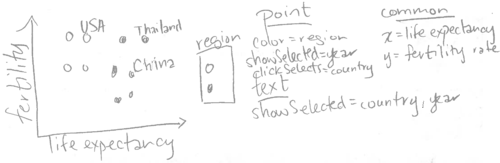

Traduction de [English](https://github.com/tdhock/animint-book/)
[Ch04-clickSelects](https://raw.githubusercontent.com/tdhock/animint-book/master/Ch04-clickSelects.Rmd)


<!-- paragraph -->

# Chapitre 4, clickSelects

<!-- paragraph -->

```{r setup, echo=FALSE}
knitr::opts_chunk$set(fig.path="Ch04-figures/")
```

<!-- paragraph -->

Ce chapitre explique clickSelects, l'un des deux principaux mots-clés introduits par animint pour la visualisation interactive de données.
<!-- comment -->
Le mot-clé clickSelects spécifie un geom pour lequel un clic met à jour une variable de sélection.
<!-- comment -->
Chaque geom d'une visualisation de données possède son propre ensemble de données et sa propre définition du mot-clé clickSelects.
<!-- comment -->
Ainsi, en cliquant sur différents geoms, on peut modifier différentes variables de sélection.

<!-- paragraph -->

Après avoir lu ce chapitre, vous serez en mesure de

<!-- paragraph -->

- Comprendre comment les légendes interactives utilisent implicitement les clickSelects.
<!-- comment -->
- Utilisez le mot-clé clickSelects dans vos esquisses de graphiques.
<!-- comment -->
- Traduisez vos esquisses de graphiques avec clickSelects en code R.
<!-- comment -->
- Utiliser le `selector.types`  pour spécifier plusieurs variables de sélection.

<!-- paragraph -->

## Les légendes interactives utilisent implicitement clickSelects {#implicit-clickSelects}

<!-- paragraph -->

Dans cette section, nous expliquerons comment le mot-clé clickSelects est implicitement utilisé dans les légendes interactives.
<!-- comment -->
Si vous avez lu les chapitres précédents, vous avez déjà utilisé implicitement clickSelects, qui a été créé automatiquement pour les légendes interactives dans les chapitres précédents.
<!-- comment -->
Par exemple, considérons l'esquisse de la viz de données de la Banque mondiale du dernier chapitre.

<!-- paragraph -->


<!-- paragraph -->

Puisque la légende a `clickSelects=region` , cliquer sur une entrée de cette légende met à jour le `region`  la variable de sélection.
<!-- comment -->
Notez que animint rend automatiquement chaque légende discrète interactive, vous n'avez donc pas besoin de spécifier explicitement `clickSelects=region`  pour la légende.
<!-- comment -->
En fait, lorsque nous avons spécifié `color=region`  pour le `geom_point` animint2 fait deux choses automatiquement :

<!-- paragraph -->

- `showSelected=region`  est assigné au même `geom_point` .
<!-- comment -->
- `clickSelects=region`  est attribuée à la légende des couleurs.

<!-- paragraph -->

Notez que `clickSelects`  ne sont pas limités aux légendes interactives.
<!-- comment -->
Chaque geom a son propre mot-clé `clickSelects`  qui détermine quelle variable de sélection est mise à jour après avoir cliqué sur ce geom.
<!-- comment -->
Dans la section suivante, nous donnerons plusieurs exemples de la manière dont les `clickSelects`  peut être utilisé en combinaison avec `showSelected`  pour créer des visualisations de données interactives.

<!-- paragraph -->

## Utiliser clickSelects pour identifier des points sur un nuage de points {#clickSelects-keyword}

<!-- paragraph -->

L'objectif de cette section est de créer la visualisation suivante des données de la Banque mondiale.

<!-- paragraph -->


<!-- paragraph -->

Pour commencer, considérons le code R suivant qui génère un nuage de points des données de la Banque mondiale :

<!-- paragraph -->

```{r Ch04-ggplot-scatter}
library(animint2)
data(WorldBank)
scatter <- ggplot()+
  geom_point(aes(
    x=life.expectancy, y=fertility.rate, color=region,
    key=country),
    showSelected="year",
    clickSelects="country",
    data=WorldBank)
scatter
```

<!-- paragraph -->

Notez que le graphique ci-dessus n'est pas interactif, car il est affiché à l'aide du périphérique graphique R traditionnel.
<!-- comment -->
En revanche, afficher le même ggplot en utilisant animint2 donne le graphique interactif suivant :

<!-- paragraph -->

```{r Ch04-viz-scatter}
(viz.scatter <- animint(
  scatter=scatter,
  duration=list(year=2000)))
```

<!-- paragraph -->

Essayez de cliquer sur des points de données dans le nuage de points ci-dessus.
<!-- comment -->
Vous devriez voir la valeur de la variable `country`  changer après avoir cliqué sur un point de données.
<!-- comment -->
Vous devriez également voir que le point de données pour le pays sélectionné est plus foncé que les autres.
<!-- comment -->
Cela permet de mettre en évidence la sélection en cours, et est effectué automatiquement pour chaque geom avec `clickSelects` .
<!-- comment -->
Par défaut, le point sélectionné a un alpha=1 (totalement opaque, pas de transparence), et les autres points ont un alpha=0,5 (semi-transparent).
<!-- comment -->
Ces valeurs par défaut peuvent être personnalisées ; par exemple, dans le code ci-dessous, un contour noir est utilisé pour mettre en évidence la sélection actuelle.

<!-- paragraph -->

```{r Ch04-viz-color-off}
animint(
  ggplot()+
    geom_point(aes(
      x=life.expectancy, y=fertility.rate, fill=region,
      key=country),
      shape=21,
      color="black",
      color_off=NA,
      showSelected="year",
      clickSelects="country",
      data=WorldBank))
```

<!-- paragraph -->

La visualisation de données ci-dessus affiche le nom du pays actuellement sélectionné dans le menu de sélection, mais il serait préférable de l'afficher sous la forme d'une étiquette de texte sur le nuage de points.
<!-- comment -->
Nous pouvons le faire en ajoutant un `geom_text`  avec deux variables showSelected :

<!-- paragraph -->

```{r Ch04-viz-text}
viz.text <- viz.scatter
viz.text$scatter <- scatter+
  geom_text(aes(
    x=life.expectancy, y=fertility.rate, label=country,
    key=country),
    showSelected=c("year", "country"),
    data=WorldBank)
viz.text
```

<!-- paragraph -->

Après avoir cliqué sur un point de données dans le nuage de points ci-dessus, vous devriez voir apparaître une étiquette de texte avec le nom du pays.
<!-- comment -->
En outre, essayez de changer l'année à l'aide du menu de sélection.
<!-- comment -->
Vous devriez voir l'étiquette de texte se déplacer dans une transition fluide en même temps que le point de données correspondant.

<!-- paragraph -->

La visualisation de données ci-dessus contient plus d'un geom, chacun avec des caractéristiques interactives différentes.
<!-- comment -->
Essayez de cliquer sur le bouton "Démarrer la visite" au bas de la visualisation de données, qui affichera les fonctions interactives disponibles pour le premier geom de la visualisation de données.
<!-- comment -->
En cliquant sur Suivant, vous obtiendrez des informations sur le prochain geom, et en cliquant sur Terminé ou sur l'arrière-plan gris, vous mettrez fin à la visite.
<!-- comment -->
La fonction "Démarrer la visite" peut être utile aux nouveaux utilisateurs de votre visualisation de données pour découvrir les fonctions interactives présentes dans chaque geom.
<!-- comment -->
Les informations affichées pendant la visite peuvent être personnalisées, en spécifiant le paramètre `help`  et `title`  de chaque geom.

<!-- paragraph -->

Comme nous l'avons expliqué dans le dernier chapitre, toute variable spécifiée à l'aide de la fonction `showSelected`  d'un geom est traitée comme une variable interactive.
<!-- comment -->
Dans l'exemple ci-dessus, nous avons spécifié deux `showSelected`  pour l'élément `geom_text` .
<!-- comment -->
Cela signifie que l'on ne dessine qu'une étiquette de texte pour les lignes de l'élément `WorldBank`  qui correspondent aux valeurs actuelles des deux variables de sélection.
<!-- comment -->
Étant donné que chaque combinaison de `country`  et `year`  a une ligne dans ces données, une seule étiquette de texte sera affichée à la fois.

<!-- paragraph -->

Essayez de cliquer sur l'entrée de la légende qui correspond à la région du pays actuellement sélectionné (par exemple, si le Canada est sélectionné, essayez de cliquer sur l'entrée de la légende Amérique du Nord).
<!-- comment -->
Vous devriez voir le point disparaître, mais le texte rester affiché.

<!-- paragraph -->

Exercice : comment faire disparaître le texte en même temps que le point ?
<!-- comment -->
Indice : il faut ajouter un mot-clé au mot-clé `geom_text` .

<!-- paragraph -->

Dans le dernier chapitre, nous avons introduit les termes "manipulation directe" et "manipulation indirecte" pour décrire les interactions avec les légendes et les menus.
<!-- comment -->
Dans l'image de données ci-dessus, nous pouvons modifier la valeur de l'élément `country`  en cliquant sur un point de données (manipulation directe) ou en utilisant le menu de sélection (manipulation indirecte).
<!-- comment -->
Les deux techniques sont utiles, mais à des fins différentes :

<!-- paragraph -->

- La manipulation directe en cliquant sur les points de données est utile pour trouver les noms des pays ayant des valeurs extrêmes de taux de fécondité et d'espérance de vie.
<!-- comment -->
Par exemple, pour l'année 1960, en cliquant sur le point en bas à gauche du graphique, on découvre le nom du pays, le Gabon.
<!-- comment -->
- La manipulation indirecte à l'aide des menus est utile pour voir la position tracée d'un pays d'intérêt.
<!-- comment -->
Par exemple, il serait difficile de trouver la France en cliquant sur tous les différents points, mais il est simple de trouver la France en tapant son nom dans le menu de sélection.

<!-- paragraph -->

Notez que lorsque l'image de données ci-dessus est affichée pour la première fois, le pays sélectionné est Andorre et l'année sélectionnée est 1960.
<!-- comment -->
Comme les données pour Andorre sont manquantes en 1960, il n'y a pas d'étiquette de texte dessinée au départ.
<!-- comment -->
Pour modifier la première sélection, vous pouvez spécifier l'option `first`  comme expliqué dans la section suivante.

<!-- paragraph -->

## La première option {#first-option}

<!-- paragraph -->

Pour spécifier la sélection qui doit être affichée lorsque la data viz est affichée pour la première fois, utilisez l'attribut `first`  option.
<!-- comment -->
Il doit s'agir d'une liste nommée avec des entrées pour chaque variable de sélection.
<!-- comment -->
Par exemple, le code ci-dessous spécifie 1970 comme première année, les États-Unis comme premier pays, et l'Amérique du Nord et l'Asie du Sud comme premières régions.

<!-- paragraph -->

```{r Ch04-viz-first}
viz.first <- viz.text
viz.first$first <- list(
  year=1970,
  country="United States",
  region=c("North America", "South Asia"))
viz.first
```

<!-- paragraph -->

Notez que dans l'image ci-dessus, il n'y a qu'un seul pays sélectionné à la fois.
<!-- comment -->
Dans la section suivante, nous expliquerons comment la fonction `selector.types`  peut être utilisée pour modifier l'option `country`  en une variable de sélection multiple.

<!-- paragraph -->

## L'option selector.types {#selector-types-option}

<!-- paragraph -->

Dans cette section, notre objectif est de produire une version légèrement plus compliquée du nuage de points de la dernière section.
<!-- comment -->
Le croquis ci-dessous ne présente qu'une seule différence par rapport à l'esquisse de la dernière section : les étiquettes de texte sont affichées pour plus d'un pays.

<!-- paragraph -->



<!-- paragraph -->

Dans animint, chaque variable de sélection a un type, soit simple, soit multiple.
<!-- comment -->
La sélection unique signifie qu'une seule valeur peut être sélectionnée à la fois.
<!-- comment -->
La sélection multiple signifie qu'un nombre quelconque de valeurs peut être sélectionné à la fois.
<!-- comment -->
Dans les graphiques de la dernière section, la sélection multiple a été utilisée pour le `region`  mais pas pour la variable `year`  et `country`  variables.
<!-- comment -->
Pourquoi ?

<!-- paragraph -->

Par défaut, animint attribue une sélection multiple à toutes les variables qui apparaissent dans les légendes discrètes interactives, et une sélection simple aux autres variables.
<!-- comment -->
Cependant, une sélection unique ou multiple peut être spécifiée en utilisant l'option `selector.types`  pour spécifier une sélection unique ou multiple.
<!-- comment -->
Dans le code R ci-dessous, nous utilisons l'option `selector.types`  pour spécifier que l'option `country`  doit être traitée comme une variable de sélection multiple.

<!-- paragraph -->

```{r Ch04-viz-multiple}
viz.multiple <- viz.first
viz.multiple$selector.types <- list(country="multiple")
viz.multiple
```

<!-- paragraph -->

Lorsque la viz de données ci-dessus est affichée pour la première fois, elle montre des points de données de l'année 1970, pour chaque pays d'Amérique du Nord et d'Asie du Sud.
<!-- comment -->
L'image affiche également une étiquette de texte pour les États-Unis.

<!-- paragraph -->

Vous avez peut-être remarqué qu'il est facile d'ajouter des pays à la sélection actuelle en cliquant sur des points de données.
<!-- comment -->
Normalement, le fait de cliquer sur un point de données sélectionné supprime ce pays de la sélection actuelle.
<!-- comment -->
Cependant, dans cette image de données particulière, il n'est pas si facile de les supprimer, car les étiquettes de texte sont affichées au-dessus des points de données.

<!-- paragraph -->

Exercice :  Reformulez l'image de données ci-dessus de manière à ce qu'un clic sur une étiquette de texte supprime le pays en question de l'ensemble de sélection.
<!-- comment -->
Indice : vous devez ajouter un `clickSelects`  au mot-clé `geom_text` .

<!-- paragraph -->

Notez que dans l'image de données ci-dessus, la variable année ne peut être modifiée que par le menu de sélection.

<!-- paragraph -->

Dans la section suivante, nous ajouterons une facette avec un geom directement cliquable pour changer la variable année.

<!-- paragraph -->

## Sélection d'une année sur un graphique de série temporelle {#time-series-plot}

<!-- paragraph -->

L'objectif de cette section est d'ajouter un graphique de série temporelle sur lequel on peut cliquer pour changer l'année sélectionnée.

<!-- paragraph -->


<!-- paragraph -->

Notez que l'esquisse ci-dessus comprend `geom_tallrect` , un nouveau geom introduit dans animint.
<!-- comment -->
Il est "grand" car il occupe tout l'espace vertical du graphique, et ne nécessite donc que la définition de ses limites horizontales via la fonction `xmin`  et `xmax`  l'esthétique.
<!-- comment -->
Spécifier `clickSelects=year`  signifie que nous voulons pouvoir dessiner un tallrect pour chaque année, et cliquer sur un tallrect pour changer l'année sélectionnée.
<!-- comment -->
Nous devons donc créer un nouvel ensemble de données appelé `years`  avec une ligne pour chaque année unique de la `WorldBank`  données.

<!-- paragraph -->

```{r}
years <- data.frame(year=unique(WorldBank$year))
head(years)
```

<!-- paragraph -->

Ensuite, nous ajoutons la série temporelle ggplot aux données existantes viz.

<!-- paragraph -->

```{r Ch04-viz-timeSeries}
viz.timeSeries <- viz.multiple
viz.timeSeries$timeSeries <- ggplot()+
  geom_tallrect(aes(
    xmin=year-0.5, xmax=year+0.5),
    clickSelects="year",
    alpha=0.5,
    data=years)+
  geom_line(aes(
    x=year, y=fertility.rate, group=country, color=region),
    clickSelects="country",
    size=3,
    alpha=0.6,
    data=WorldBank)
viz.timeSeries
```

<!-- paragraph -->

Essayez de cliquer sur l'arrière-plan de la série temporelle dans l'image de données ci-dessus.
<!-- comment -->
Vous devriez voir les points de données et les étiquettes de texte se déplacer dans une transition fluide vers leur place à l'année nouvellement sélectionnée.

<!-- paragraph -->

Exercice d'animation : rendez la viz de données animée en spécifiant l'option `time`  option, [comme expliqué au chapitre 3](Ch03-showSelected.html#animation-time) .

<!-- paragraph -->

Exercice à plusieurs niveaux : ajouter un `geom_text`  qui indique l'année en cours sur le nuage de points.
<!-- comment -->
Ajouter un `geom_path`  qui présente les données des 5 dernières années.

<!-- paragraph -->

## Sélection d'une année sur une facette de série temporelle {#time-series-facet}

<!-- paragraph -->

L'objectif de cette section est d'ajouter une facette avec un graphique de série temporelle sur lequel on peut cliquer pour changer l'année sélectionnée.

<!-- paragraph -->


<!-- paragraph -->

Tout d'abord, nous recréons le nuage de points de la section précédente à l'aide de la fonction [addColumn then facet idiom](Ch99-appendix.html#addColumn-then-facet) qui est utile pour créer des ggplots avec des axes alignés.

<!-- paragraph -->

```{r Ch04-ggplot-scatterFacet}
add.x.var <- function(df, x.var){
  data.frame(df, x.var=factor(x.var, c("life expectancy", "year")))
}
scatterFacet <- ggplot()+
  geom_point(aes(
    x=life.expectancy, y=fertility.rate, color=region,
    key=country),
    showSelected="year",
    clickSelects="country",
    data=add.x.var(WorldBank, "life expectancy"))+
  geom_text(aes(
    x=life.expectancy, y=fertility.rate, label=country,
    key=country),
    clickSelects="country",
    showSelected=c("year", "country", "region"),
    data=add.x.var(WorldBank, "life expectancy"))+
  facet_grid(. ~ x.var, scales="free")+
  xlab("")+
  theme_bw()+
  theme(panel.margin=grid::unit(0, "lines"))
scatterFacet
```

<!-- paragraph -->

Notez que le ggplot ci-dessus utilise la même méthode que le `aes`  définitions que le nuage de points de la section précédente.
<!-- comment -->
La seule différence réside dans le fait que nous avons utilisé un `WorldBank`  avec un ensemble de données supplémentaires `x.var`  que nous utilisons avec `facet_grid` .
<!-- comment -->
Ci-dessous, nous ajoutons des geoms pour un graphique de série temporelle qui est tracé sur l'axe du taux de fécondité.

<!-- paragraph -->

```{r Ch04-ggplot-scatterTS}
scatterTS <- scatterFacet+
  geom_tallrect(aes(
    xmin=year-0.5, xmax=year+0.5),
    clickSelects="year",
    alpha=0.5,
    data=add.x.var(years, "year"))+
  geom_line(aes(
    x=year, y=fertility.rate, group=country, color=region),
    clickSelects="country",
    size=3,
    alpha=0.6,
    data=add.x.var(WorldBank, "year"))
scatterTS
```

<!-- paragraph -->

Les deux geom définis ci-dessus occupent une nouvelle facette pour le `"year"`  de la valeur `x.var`  (définie par l'élément `add.x.var`  fonction).
<!-- comment -->
Puisque ces deux geoms ont des définitions différentes de `clickSelects` un clic sur chaque geom mettra à jour le graphique d'une manière différente.
<!-- comment -->
Notez que pour le `geom_line`  nous spécifions `size=3` ce qui signifie une largeur de trait de 3 pixels.
<!-- comment -->
En général, il est bon d'augmenter la taille des geoms avec `clickSelects` afin qu'il soit plus facile de cliquer dessus.

<!-- paragraph -->

Notez également que nous avons spécifié `alpha=0.5`  pour le `geom_tallrect`  et `alpha=0.6`  pour les `geom_line` .
<!-- comment -->
Puisque ces deux geoms définissent `clickSelects` , certaines lignes tracées et tallrect seront sélectionnées, et d'autres ne le seront pas.
<!-- comment -->
Les valeurs alpha dans le code R spécifient l'opacité des objets sélectionnés, et les autres objets auront une valeur `alpha`  opacité inférieure de 0,5 à cette valeur.
<!-- comment -->
Dans l'exemple ci-dessus, les lignes non sélectionnées auront une opacité de `alpha=0.1` et les hauts-reliefs non sélectionnés auront `alpha=0`  (complètement transparent).

<!-- paragraph -->

À partir de septembre 2023, il est également possible de spécifier l'opacité, le remplissage et la couleur pour les objets qui ne sont pas actuellement sélectionnés ( `alpha_off` , `fill_off` , `color_off` ).
<!-- comment -->
Les utilisateurs peuvent spécifier ces paramètres dans le geom (pas dans l'aes) pour créer librement une apparence différente pour les éléments sélectionnés et non sélectionnés, au lieu d'être contraints de s'appuyer sur le comportement décrit ci-dessus.
<!-- comment -->
Pour plus d'informations, voir la discussion et l'exemple dans [chapitre 6, section Spécifier le mode d'affichage de l'état de la sélection](Ch06-other.html#display-selection-state) .

<!-- paragraph -->

Enfin, nous utilisons le code R ci-dessous pour afficher le nouveau nuage de points aligné et la série temporelle à l'aide d'animint.

<!-- paragraph -->

```{r Ch04-viz-facets}
(viz.facets <- animint(scatterTS))
```

<!-- paragraph -->

L'image de données interactives ci-dessus contient un nouveau panneau avec des lignes qui montrent une série chronologique de taux de fécondité sur toutes les années.
<!-- comment -->
Puisque nous avons spécifié `clickSelects=country`  pour l'élément `geom_line` un clic sur une ligne met à jour l'ensemble des pays sélectionnés.
<!-- comment -->
Puisque nous avons spécifié `clickSelects=year`  pour l'élément `geom_tallrect` un clic sur un rectangle met à jour l'année sélectionnée.

<!-- paragraph -->

Exercice : ajouter `time` , `duration` , `first` et `selector.types`  aux données ci-dessus.

<!-- paragraph -->

## Résumé du chapitre et exercices {#exercises}

<!-- paragraph -->

Ce chapitre explique `clickSelects` , l'un des deux principaux mots-clés introduits par animint pour la conception de visualisations de données interactives.
<!-- comment -->
Nous avons utilisé l'ensemble des données de la Banque mondiale pour montrer comment `clickSelects`  peut être utilisé pour spécifier différentes interactions pour chacun des geoms tracés.
<!-- comment -->
Nous avons expliqué comment la fonction `first`  peut être utilisée pour spécifier les valeurs sélectionnées qui sont utilisées lorsque l'animint est affiché pour la première fois.
<!-- comment -->
Nous avons également expliqué comment l'option `selector.types`  peut être utilisée pour spécifier plusieurs variables de sélection.

<!-- paragraph -->

Exercices :

<!-- paragraph -->

- Jusqu'à présent, nous avons vu trois façons différentes de modifier les variables de sélection : (1) les légendes interactives, (2) les menus de sélection et (3) le fait de cliquer sur les données à l'aide de la touche `clickSelects` .
<!-- comment -->
Classez ces trois techniques de la plus directe à la moins directe.
<!-- comment -->
Quelle technique est préférable dans quelles circonstances ?
<!-- comment -->
- Quand `geom_point(clickSelects=something, alpha=0.75)`  est affiché avec le périphérique graphique R habituel, quel est le degré d'opacité/transparence pour tous les points de données ?
<!-- comment -->
Lorsque animint2 affiche le même geom, certains points seront sélectionnés et d'autres non.
<!-- comment -->
Quelle est l'opacité/transparence des points sélectionnés ?
<!-- comment -->
Quelle est l'opacité/transparence des points non sélectionnés ?
<!-- comment -->
- Ajouter `aes(size=population)`  aux points du nuage de points de la Banque mondiale.
<!-- comment -->
La légende de la taille est-elle interactive ?
<!-- comment -->
Pourquoi ?
<!-- comment -->
- Ajouter un `geom_text`  au nuage de points de la Banque mondiale qui montre l'année sélectionnée.
<!-- comment -->
- Ajouter un `geom_text`  à la série chronologique de la Banque mondiale pour afficher les noms des pays sélectionnés.
<!-- comment -->
- Ajouter un `geom_path`  au nuage de points de la Banque mondiale pour afficher les données des cinq dernières années.
<!-- comment -->
- Utiliser le diagramme de dispersion de la `time`  pour créer une version animée de `viz.facets` .
<!-- comment -->
- Utiliser `help`  et `title`  pour chaque geom en `viz.facets` afin de créer une tournée plus informative sur ce qui est affiché dans chaque geom.

<!-- paragraph -->

Suivant, [Chapitre 5](Ch05-sharing.html)  explique différentes méthodes pour publier et partager des animints sur le web.

<!-- paragraph -->


