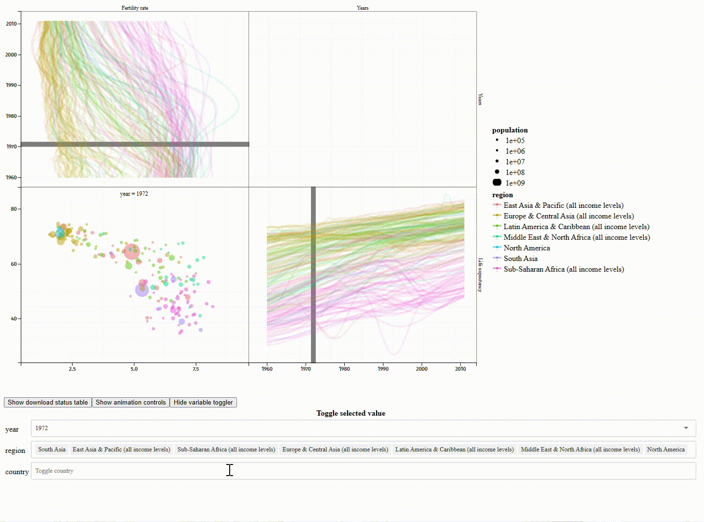

# Manuel francophone pour animint2 : visualisation de données dans R

Regarder la dernière version que nous travaillons sur
<https://main--animint-manual-fr.netlify.app/> qui est la traduction du
[Animint2 Manual](https://rcdata.nau.edu/genomic-ml/animint2-manual/Ch00-preface.html). 

Diapositives en [Anglais](https://docs.google.com/presentation/d/1QDwo9x4OM7UKAXffJrny6nSfeytFR0kO5NB-NQEspcE/edit?usp=sharing) et [français](https://docs.google.com/presentation/d/1WpRZs9qz9wm1yik_MLj8tIJyWuL5-IBPYKLhOHZ9X4Y/edit?usp=sharing) pour une présentation de 30 à 60 minutes sur animint2 !
[Résumé](https://github.com/animint/animint2/wiki/Presentations#30-60-minute-talk),
[Vidéo de la présentation à Toulouse-Dataviz](https://www.youtube.com/watch?v=Em6AVJi37zo).

## A propos de

Animint2 est un package R permettant de générer et de partager des visualisations de données interactives animées, parfois appelées animints. C'est un fork de, et utilise une syntaxe similaire à, [ggplot2](https://ggplot2.tidyverse.org/). Animint2 est particulièrement utile pour les grands jeux de données, mais des jeux de données plus petits peuvent également être rendus interactifs. Il est également capable de générer des visualisations de données statiques.

 

Jouer avec [cette visualisation interactive de données de la Banque mondiale.](https://rcdata.nau.edu/genomic-ml/WorldBank-facets/) ou [une version plus récente qui comprend également une carte du monde](https://tdhock.github.io/2025-01-WorldBank-facets-map/). Pour plus d'exemples, voir ces galeries, qui présentent des captures d'écran ainsi que des liens vers l'affichage interactif des données et le code source :

- [NAU rcdata animint gallery](https://rcdata.nau.edu/genomic-ml/animint-gallery/) contient plus de 50 exemples de viz big data datant de la création d'animint en 2014.
- [GitHub Pages animint gallery](https://animint.github.io/gallery) est une collection plus récente d'animints qui ont été publiés à l'aide de l'outil `animint2pages` fonction.
- [GitHub Pages galerie en français](https://animint.github.io/gallery-fr) est une collection plus récente d'animints qui ont été publiés à l'aide de l'outil `animint2pages` fonction.

